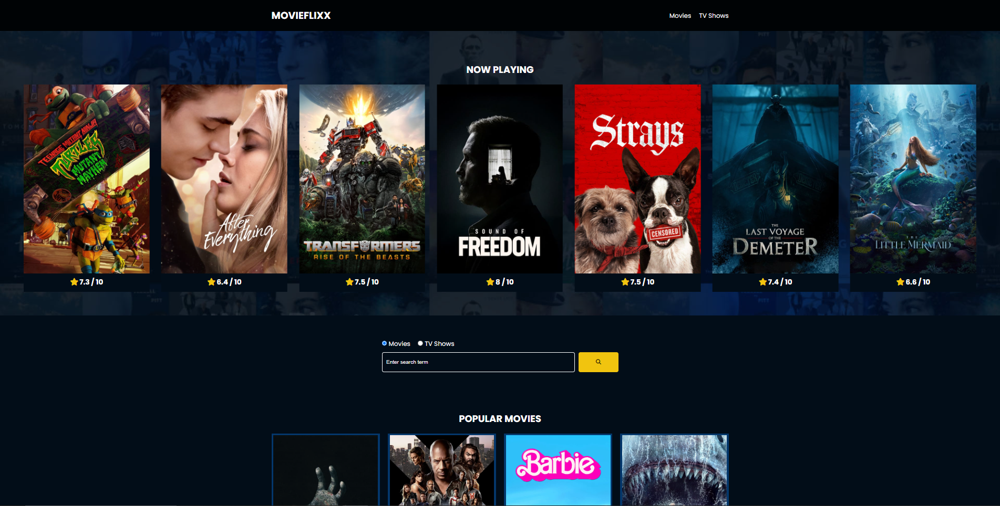

# MOVIEFLIXX: Project Overview

- A website developed purely based on vanilla javascript, HTML and CSS to show popular movies and tv shows and newly released movies and tv shows using the publicly available **themoviedb** publicly avalilable API.
- When clciked on a movie, a page displaying the details of the movie is shown.

## Code and Resources Used

**Vanilla Javascript**
**HTML**
**CSS**

**Packages:** fontawesome, swiper
**themoviedb API Source:** https://developer.themoviedb.org/

Website UI:

